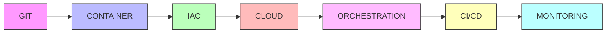

# 🚀 ROADMAP APPRENTISSAGE DEVOPS
## Parcours Complet Step-by-Step

---

## 📊 Vue d'Ensemble du Parcours



---

## 🎯 Durée Totale Estimée: 16-20 semaines

| Phase | Domaine | Durée | Niveau Final |
|-------|---------|-------|--------------|
| **Phase 1** | [GIT](#phase-1--git-2-semaines) | 2 semaines | ⭐⭐⭐ |
| **Phase 2** | [CONTAINER](#phase-2--container-3-semaines) | 3 semaines | ⭐⭐⭐⭐ |
| **Phase 3** | [IAC](#phase-3--iac-6-semaines) | 6 semaines | ⭐⭐⭐⭐⭐ |
| **Phase 4** | [CLOUD](#phase-4--cloud-3-semaines) | 3 semaines | ⭐⭐⭐⭐ |
| **Phase 5** | [ORCHESTRATION](#phase-5--orchestration-4-semaines) | 4 semaines | ⭐⭐⭐⭐⭐ |
| **Phase 6** | [CI/CD](#phase-6--cicd-2-semaines) | 2 semaines | ⭐⭐⭐⭐ |
| **Phase 7** | [MONITORING](#phase-7--monitoring-2-semaines) | 2 semaines | ⭐⭐⭐⭐ |

---

## 📅 Planning Hebdomadaire Type

**Charge de travail recommandée:** 8-12h/semaine

| Jour | Activité | Temps |
|------|----------|-------|
| **Lundi** | 📖 Théorie + Concepts | 1-2h |
| **Mardi** | 💻 Exercices pratiques | 2-3h |
| **Mercredi** | 🔬 Expérimentation | 1-2h |
| **Jeudi** | 💻 Exercices pratiques | 2-3h |
| **Vendredi** | 🚀 Mini-projet | 2-3h |
| **Weekend** | 📝 Révision + Documentation | 1h |

---

## Phase 1 : GIT (2 semaines)

### 🎯 Objectifs
- Maîtriser le versioning de code
- Comprendre les workflows Git
- Travailler en équipe avec Git

### 📚 Contenu
**Semaine 1: Fondamentaux**
- Installation et configuration
- Init, add, commit, status
- Branches et merge
- Résolution de conflits

**Semaine 2: Workflows Avancés**
- Git Flow
- Pull Requests
- Rebase vs Merge
- Git hooks
- Bonnes pratiques

### ✅ Compétences Acquises
- [ ] Créer et gérer un repository
- [ ] Utiliser branches et tags
- [ ] Résoudre les conflits
- [ ] Collaborer via PR
- [ ] Automatiser avec hooks

### 📂 Ressources
- [GIT/README.md](./GIT/README.md)
- Exercices pratiques dans `GIT/exercices/`

---

## Phase 2 : CONTAINER (3 semaines)

### 🎯 Objectifs
- Maîtriser Docker
- Comprendre la containerisation
- Découvrir les alternatives

### 📚 Contenu
**Semaine 1: Docker Basics**
- Concepts: Images, Containers
- Dockerfile
- Docker CLI
- Volumes et networks

**Semaine 2: Docker Avancé**
- Multi-stage builds
- Docker Compose
- Optimisation images
- Best practices sécurité

**Semaine 3: Alternatives**
- Podman (rootless)
- LXC/LXD
- Comparaisons

### ✅ Compétences Acquises
- [ ] Créer des Dockerfiles optimisés
- [ ] Orchestrer avec Docker Compose
- [ ] Gérer volumes et networks
- [ ] Sécuriser les containers
- [ ] Utiliser Podman

### 📂 Ressources
- [CONTAINER/DOCKER/README.md](./CONTAINER/DOCKER/README.md)
- [CONTAINER/PODMAN/README.md](./CONTAINER/PODMAN/README.md)

---

## Phase 3 : IAC (6 semaines)

### 🎯 Objectifs
- Maîtriser Terraform
- Automatiser avec Ansible
- Infrastructure production-ready

### 📚 Contenu
**Semaines 1-2: Terraform Basics** ✅ *Déjà disponible*
- Providers, Resources
- Variables, Outputs
- State management

**Semaines 3-4: Terraform Avancé** ✅ *Déjà disponible*
- Modules
- Remote state
- Workspaces

**Semaine 5: Ansible** ✅ *Déjà disponible*
- Playbooks, Roles
- Inventaires
- Templates

**Semaine 6: Intégration** ✅ *Déjà disponible*
- Terraform + Ansible
- Tests infrastructure
- CI/CD

### ✅ Compétences Acquises
- [ ] Provisionner infra avec Terraform
- [ ] Créer modules réutilisables
- [ ] Configurer serveurs avec Ansible
- [ ] Automatiser déploiements

### 📂 Ressources
- [IAC/README.md](./IAC/README.md) ✅
- [IAC/PARCOURS-PEDAGOGIQUE.md](./IAC/PARCOURS-PEDAGOGIQUE.md) ✅

---

## Phase 4 : CLOUD (3 semaines)

### 🎯 Objectifs
- Maîtriser AWS/Azure/GCP
- Services cloud essentiels
- Architecture cloud

### 📚 Contenu
**Semaine 1: AWS**
- EC2, S3, RDS
- VPC, Security Groups
- IAM
- CloudFormation

**Semaine 2: Azure**
- Virtual Machines
- Storage Accounts
- Azure DevOps
- ARM Templates

**Semaine 3: GCP/Multi-Cloud**
- Compute Engine
- Cloud Storage
- Comparaison providers
- Stratégies multi-cloud

### ✅ Compétences Acquises
- [ ] Déployer sur AWS
- [ ] Déployer sur Azure
- [ ] Gérer identités (IAM)
- [ ] Architectures cloud natives
- [ ] Optimiser coûts

### 📂 Ressources
- [CLOUD/AWS/README.md](./CLOUD/AWS/README.md)
- [CLOUD/AZURE/README.md](./CLOUD/AZURE/README.md)

---

## Phase 5 : ORCHESTRATION (4 semaines)

### 🎯 Objectifs
- Maîtriser Kubernetes
- Déployer apps en production
- High Availability & Scaling

### 📚 Contenu
**Semaine 1: K8s Concepts**
- Pods, Deployments
- Services, Ingress
- ConfigMaps, Secrets

**Semaine 2: K8s Pratique**
- Helm charts
- StatefulSets
- Persistent Volumes

**Semaine 3: K8s Avancé**
- RBAC
- Network Policies
- Auto-scaling (HPA/VPA)

**Semaine 4: Production**
- Monitoring K8s
- Logging
- Sécurité
- GitOps (ArgoCD/Flux)

### ✅ Compétences Acquises
- [ ] Déployer apps sur K8s
- [ ] Créer Helm charts
- [ ] Gérer scaling automatique
- [ ] Sécuriser clusters
- [ ] Implémenter GitOps

### 📂 Ressources
- [ORCHESTRATION/K8S/README.md](./ORCHESTRATION/K8S/README.md)

---

## Phase 6 : CI/CD (2 semaines)

### 🎯 Objectifs
- Pipelines automatisés
- Tests automatisés
- Déploiement continu

### 📚 Contenu
**Semaine 1: CI (Continuous Integration)**
- GitHub Actions
- GitLab CI
- Tests unitaires/intégration
- Quality gates

**Semaine 2: CD (Continuous Deployment)**
- Stratégies de déploiement
- Blue/Green, Canary
- Rollback automatique
- Infrastructure as Code CI/CD

### ✅ Compétences Acquises
- [ ] Créer pipelines CI/CD
- [ ] Automatiser tests
- [ ] Déploiements automatiques
- [ ] Stratégies de release

### 📂 Ressources
- [GIT/CI/README.md](./GIT/CI/README.md)
- [GIT/CD/README.md](./GIT/CD/README.md)

---

## Phase 7 : MONITORING (2 semaines)

### 🎯 Objectifs
- Observer l'infrastructure
- Alerting intelligent
- Debugging production

### 📚 Contenu
**Semaine 1: Métriques & Logs**
- Prometheus
- Grafana
- Alertmanager
- PromQL

**Semaine 2: Logs & APM**
- ELK/Elastic Stack
- Loki
- Distributed tracing
- Dashboards

### ✅ Compétences Acquises
- [ ] Configurer Prometheus
- [ ] Créer dashboards Grafana
- [ ] Gérer logs (ELK)
- [ ] Alerting efficace

### 📂 Ressources
- [MONITORING/PROMETHEUS/README.md](./MONITORING/PROMETHEUS/README.md)
- [MONITORING/GRAFANA/README.md](./MONITORING/GRAFANA/README.md)

---

## 🎯 Projets Intégrateurs

### Projet 1: Application Web Complète (Semaine 10)
**Stack:** Docker + Terraform + AWS  
**Durée:** 1 semaine

### Projet 2: Microservices sur K8s (Semaine 16)
**Stack:** K8s + Helm + CI/CD + Monitoring  
**Durée:** 2 semaines

### Projet 3: Infrastructure Multi-Cloud (Semaine 20)
**Stack:** Terraform + Ansible + AWS + Azure + K8s  
**Durée:** 2 semaines

---

## 📊 Évaluation de Progression

### Auto-Évaluation par Phase

**🌱 Débutant (Phases 1-2)**
- Je comprends les concepts de base
- Je peux suivre des tutoriels
- J'ai besoin de documentation

**🌿 Intermédiaire (Phases 3-5)**
- Je résous des problèmes seul
- Je crée mes propres solutions
- Je comprends les erreurs

**🌳 Avancé (Phases 6-7)**
- J'architecture des solutions
- Je forme d'autres personnes
- Je contribue à la communauté

---

## 💡 Méthodologie d'Apprentissage

### Règle des 3P
1. **Pratiquer** (60%) - Faire des exercices
2. **Projets** (30%) - Applications réelles
3. **Pédagogie** (10%) - Expliquer aux autres

### Routine Quotidienne
```
09:00 - 09:30 | 📖 Lecture théorique
09:30 - 11:00 | 💻 Exercices pratiques
11:00 - 11:15 | ☕ Pause
11:15 - 12:00 | 🔬 Expérimentation
```

### Outils de Suivi
- [ ] Journal d'apprentissage quotidien
- [ ] Portfolio de projets sur GitHub
- [ ] Blog technique (optionnel)

---

## 🎓 Certifications Recommandées

| Certification | Après Phase | Coût | Difficulté |
|---------------|-------------|------|------------|
| **Git Fundamentals** | Phase 1 | Gratuit | ⭐ |
| **Docker Certified Associate** | Phase 2 | $195 | ⭐⭐ |
| **HashiCorp Terraform Associate** | Phase 3 | $70 | ⭐⭐⭐ |
| **AWS Solutions Architect** | Phase 4 | $150 | ⭐⭐⭐⭐ |
| **CKA (Kubernetes Administrator)** | Phase 5 | $395 | ⭐⭐⭐⭐⭐ |
| **AWS DevOps Engineer** | Phase 6-7 | $300 | ⭐⭐⭐⭐⭐ |

---

## 🔗 Navigation

- 📘 [Guide IAC Complet](./IAC/README.md)
- 📗 [Parcours Pédagogique IAC](./IAC/PARCOURS-PEDAGOGIQUE.md)
- 📙 Guides par domaine (voir sections ci-dessus)

## 🚀 Commencer Maintenant

**Étape 1:** Choisir votre point de départ
- Débutant complet → Phase 1 (GIT)
- Connaissance de base → Phase 2 ou 3

**Étape 2:** Configurer votre environnement
- VS Code + Extensions DevOps
- Docker Desktop
- Compte cloud (AWS/Azure free tier)

**Étape 3:** Commencer le premier exercice
```bash
cd GIT/
cat README.md
```

---

**"Le DevOps est un voyage, pas une destination"** 🚀

*Dernière mise à jour: 2025-12-15*
